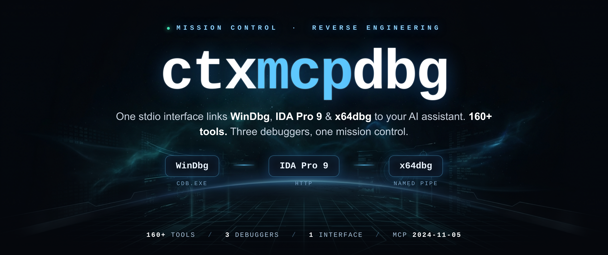
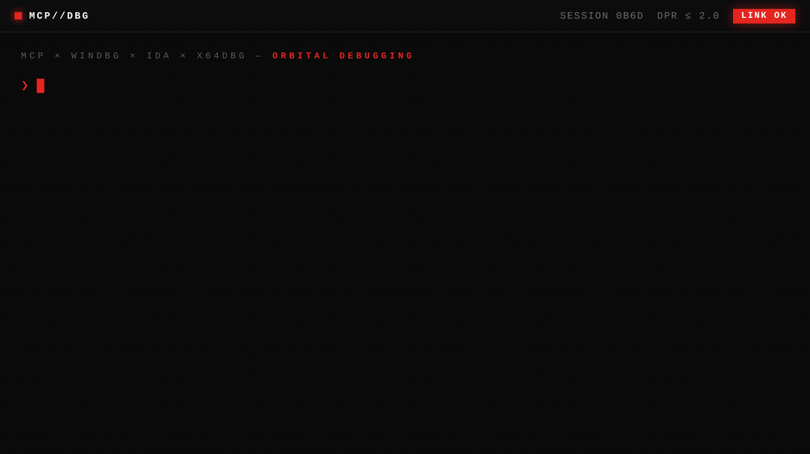
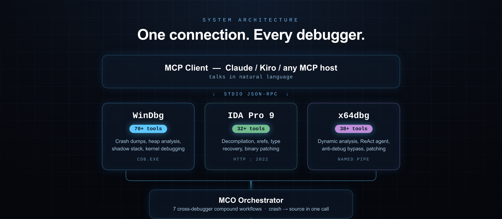

<p align="center">
  
</p>

<p align="center">
  <b>MCP servers for WinDbg, IDA Pro, and x64dbg</b><br>
  One stdio interface · 160+ tools · Three debuggers, one client.
</p>

<p align="center">
  
  
  
  
  
</p>

<p align="center">
  <a href="#-quick-start">Quick Start</a> ·
  <a href="#-architecture">Architecture</a> ·
  <a href="#-servers">Servers</a> ·
  <a href="#-key-workflows">Workflows</a> ·
  <a href="https://github.com/DdUdle/ctxdebug/issues">Report an Issue</a>
</p>

<p align="center">
  <b>Website</b> · <a href="https://ctxdebug.xyz">ctxdebug.xyz</a> &nbsp;·&nbsp;
  <b>Contact</b> · <a href="mailto:info@ctxdebug.xyz">info@ctxdebug.xyz</a> &nbsp;·&nbsp;
  <b>Status</b> · Public alpha
</p>

<p align="center"><sub>For authorized reverse engineering, crash analysis, and security research on systems you own or have permission to analyze.</sub></p>

---

## ▎ Overview

**ctxdebug** is an MCP (Model Context Protocol) platform that connects **WinDbg**, **IDA Pro 9.x**, and **x64dbg** to AI coding assistants. Use it for crash dump analysis, static review in IDA, and live debugging in x64dbg — without copying output between windows.

One stdio interface. **160+ tools.** Three debuggers, one client.

> **How it works.** Each debugger is exposed as an MCP tool server. You talk to Claude, Kiro, or any MCP-compatible client; the client calls the debuggers. No copy-paste, no manual correlation between tools.

> **Example.** You ask: *"analyze this crash dump and find the root cause."* ctxdebug opens the dump in WinDbg, runs `!analyze -v`, takes the faulting address, decompiles the function in IDA Pro, and returns a combined report with pseudocode and the caller chain.

---

## ▎ Demo

<p align="center">
  
</p>

<p align="center"><sub>One prompt → WinDbg opens the dump, analyzes the crash, IDA decompiles the faulting function — combined report in ~1.8s.</sub></p>

---

## ▎ Quick Start

### Requirements

- **Python** 3.11+
- **OS** Windows 10 / 11
- **At least one debugger** — WinDbg (Windows SDK) · IDA Pro 9.x · x64dbg

### Install

```bash
git clone https://github.com/DdUdle/ctxdebug.git
cd ctxdebug
pip install -e .
```

### Register servers

Individual servers:

```bash
claude mcp add windbg       -- python windbg_mcp.py
claude mcp add ida          -- python ida_mcp.py
claude mcp add x64dbg       -- python -m agent --mcp
claude mcp add mco          -- python mco_orchestrator.py
claude mcp add mco-sessions -- python mco_sessions.py
```

Or use the unified gateway — one server, every tool:

```bash
claude mcp add mco-gateway -- python mco_gateway.py
```

See `mcp_config_example.json` for full JSON configuration with environment variables.

### Try it

Once a server is registered, ask your AI client:

```text
Open C:\dumps\crash.dmp, run a full crash analysis,
and decompile the function at the fault address.
```

The orchestrator chains `windbg_open_dump` → `windbg_analyze_crash` → `mco_pivot_to_ida` and returns pseudocode with the caller chain.

---

## ▎ Features

| Capability | What it does |
|---|---|
| **Live debugger control** | Run, pause, step, and inspect a process through x64dbg. Set breakpoints on API groups (`memory`, `network`, `crypto`) instead of one address at a time. |
| **Cross-debugger pivot** | Take an address from a WinDbg crash dump and open it in IDA Pro for decompilation, callers, and callees in one tool call. |
| **Goal-driven analysis** | The x64dbg server includes an optional ReAct agent (`agent_analyze`) that plans multi-step goals — for example finding an unpacking loop or listing anti-analysis checks — by chaining tool calls. Works with Claude, Groq, local Ollama, or heuristics only. |
| **Persistent notes** | The agent stores packer signatures, anti-analysis patterns, and notes from earlier sessions, and can recall them on new targets. |
| **Session recording** | Tool calls can be logged to SQLite with full-text search (FTS5). Replay a timeline, compare two sessions, or export a Markdown report. |
| **Anti-analysis survey** | Combines a static scan (IDA imports/patterns) and a dynamic scan (x64dbg PEB/RDTSC) into one report. Optional lab patches (PEB flags, instruction edits) for samples you are authorized to analyze. |

---

## ▎ Architecture

<p align="center">
  
</p>

- **Transport** — stdio JSON-RPC (MCP `2024-11-05`)
- **IDA** — HTTP REST on `localhost:2022`, auto-discovers the endpoint from 6 candidates
- **x64dbg** — binary framing over a named pipe (`X64A` magic + uint32 length + 8-byte padding + JSON)
- **Agent** — ReAct loop with pluggable LLM backends (Claude, Groq, OpenRouter, local Ollama, or heuristics only)
- **Sessions** — SQLite with FTS5, WAL mode, thread-safe
- **Gateway** — starts sub-servers as child processes and proxies tool calls through one stdio connection

---

## ▎ Servers

| Server | File | What it does | Tools |
|---|---|---|:--:|
| `windbg` | `windbg_mcp.py` | Crash dumps, heap analysis, shadow stack, kernel debugging | 70+ |
| `ida` | `ida_mcp.py` | Decompilation, xrefs, type recovery, binary patching | 32+ |
| `x64dbg` | `agent/` | Dynamic analysis, ReAct agent, memory inspection and patching | 38+ |
| `mco` | `mco_orchestrator.py` | Cross-debugger compound workflows | 7 |
| `mco-sessions` | `mco_sessions.py` | Session recording, FTS search, Markdown export | 13 |
| `mco-gateway` | `mco_gateway.py` | Unified proxy — all servers through one connection | all |

---

## ▎ Debugger setup

<details>
<summary><b>WinDbg</b></summary>

Needs `cdb.exe` from the Windows SDK. Default path:

```text
C:\Program Files (x86)\Windows Kits\10\Debuggers\x64\cdb.exe
```

Set `WINDBG_MCP_CDB` if your path differs. No pre-launch needed — tools open dumps or attach on demand.

</details>

<details>
<summary><b>IDA Pro 9.x</b></summary>

1. Open IDA Pro 9.x with a binary loaded.
2. In the Python console, run:

   ```python
   exec(open(r'path\to\ctxdebug\ida_server_plugin.py').read())
   ```

3. HTTP server starts on port `2022`.

</details>

<details>
<summary><b>x64dbg</b></summary>

1. Build the C++ plugin:

   ```bash
   cd agent\plugins
   build_plugin.bat
   ```

2. Copy `mco_agent.dp64` to x64dbg's plugin directory.
3. Restart x64dbg — the plugin exposes named pipe `\\.\pipe\x64dbg_ai_agent`.

</details>

---

## ▎ Key Workflows

**Crash dump → source (one command)**

```python
mco_crash_to_source(dump_path="C:\\dumps\\crash.dmp")
```

Opens the dump, runs `!analyze -v`, extracts the faulting address, decompiles the crashing function in IDA, and returns pseudocode with callers.

**Anti-analysis report**

```python
mco_bossix_report()
bossix_hide()            # PEB flag adjustments (lab)
bossix_patch(address)    # NOP / flip JCC at a check (lab)
```

For authorized lab analysis of samples that implement anti-debug checks.

**Pivot an address to pseudocode**

```python
mco_pivot_to_ida(address="0x7FF712340000")
```

**Goal-driven analysis**

```python
agent_analyze(goal="Find the unpacking loop and identify the OEP")
```

The agent plans a sequence of tool calls, executes them, and reports findings — with or without an LLM backend.

**Session recording**

```python
session_start(name="crash dump review")
# ... do your work ...
session_end(notes="null deref in CRenderObject::Destroy")
session_export_markdown(session_id=1)
```

---

## ▎ x64dbg Server Modes

| Mode | Command |
|---|---|
| Tool-only (default) | `python -m agent --mcp` |
| Claude reasoning | `python -m agent --mcp --llm claude --api-key sk-...` |
| Local Ollama | `python -m agent --mcp --llm local --llm-model deepseek-r1` |
| Groq (free tier) | `python -m agent --mcp --llm groq` |
| OpenRouter | `python -m agent --mcp --llm openrouter` |
| Interactive CLI | `python -m agent --cli` |

---

## ▎ Environment Variables

| Variable | Server | Purpose |
|---|---|---|
| `WINDBG_MCP_CDB` | windbg | Path to cdb.exe |
| `IDA_MCP_HOST` | ida | IDA HTTP host (default: `localhost`) |
| `IDA_MCP_PORT` | ida | IDA HTTP port (default: `2022`) |
| `IDA_MCP_TOKEN` | ida | Bearer token for the IDA HTTP server — required to bind it off loopback |
| `IDA_SERVER_HOST` | ida | Bind address of the in-IDA HTTP server (default: `127.0.0.1`) |
| `X64DBG_PATH` | x64dbg | Path to x64dbg.exe |
| `X64DBG_PIPE` | x64dbg | Named pipe path |
| `ANTHROPIC_API_KEY` | x64dbg | Only needed with `--llm claude` |
| `GROQ_API_KEY` | x64dbg | Only needed with `--llm groq` |
| `MCO_SESSIONS_DB` | sessions | SQLite database path |
| `MCO_SERVERS` | gateway | Comma-separated subset of servers to enable |

---

## ▎ Project Structure

```text
ctxdebug/
├── windbg_mcp.py           # WinDbg MCP server
├── ida_mcp.py              # IDA Pro MCP server
├── ida_server_plugin.py    # IDA Python plugin (starts HTTP server)
├── mco_orchestrator.py     # Cross-debugger meta-tools
├── mco_sessions.py         # Session recording (SQLite + FTS5)
├── mco_gateway.py          # Unified gateway proxy
├── agent/
│   ├── __main__.py         # x64dbg MCP entry point + LLM backend selection
│   ├── core.py             # ReAct agent (Observe → Think → Act)
│   ├── memory.py           # Persistent memory store (~/.x64ai/)
│   ├── bridge.py           # Named-pipe IPC to x64dbg plugin
│   ├── mcp_server.py       # Tool definitions (38+)
│   ├── skills/             # Modular skill implementations
│   └── plugins/
│       ├── x64dbg_plugin.cpp
│       └── build_plugin.bat
├── mcp_config_example.json # Ready-to-use MCP client config
└── pyproject.toml
```

---

## ▎ Development

```bash
git clone https://github.com/DdUdle/ctxdebug.git
cd ctxdebug
pip install -e ".[dev]"
pytest
```

---

## ▎ Contributing

Contributions are welcome. Please open an issue before starting large changes so the approach can be discussed first.

---

## ▎ License

**MIT** — see [`LICENSE`](LICENSE).

<p align="center"><sub>WinDbg · IDA Pro · x64dbg — one MCP client.</sub></p>
